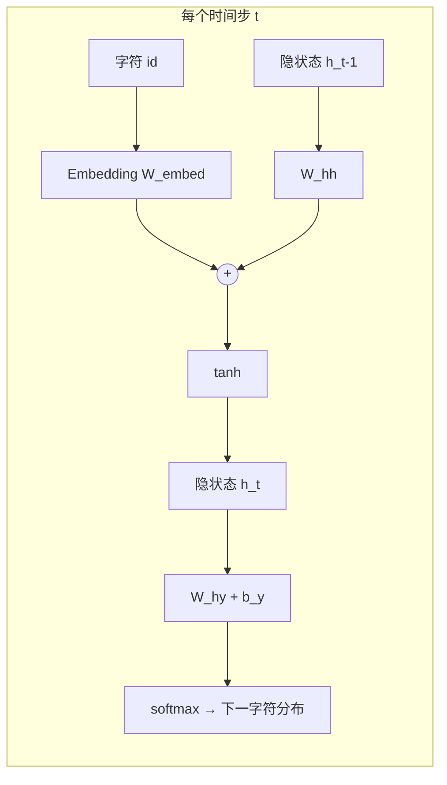
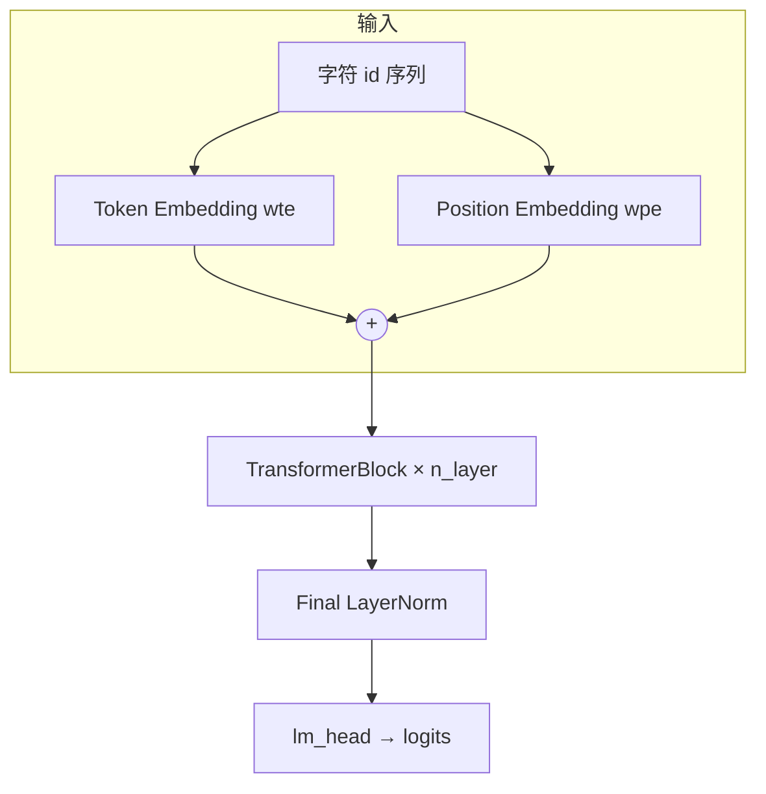

# simple_nn

独立于 [PlanAI](https://github.com/) 主项目的 Python 学习示例。所有神经网络逻辑均用 **纯 NumPy** 手写（前向、反向、梯度更新），不依赖 PyTorch、TensorFlow 或任何自动求导框架。

本目录包含三个由浅入深的 demo：

1. **XOR MLP** — 两层全连接网络，理解非线性分类与反向传播  
2. **字符级 RNN 语言模型 MVP** — 最小「LLM」形态：下一字符预测 + 自回归采样生成  
3. **字符级 Transformer 语言模型 MVP** — Decoder-only GPT 风格：因果自注意力 + Pre-LN + FFN  

---

## 目录

- [环境要求](#环境要求)
- [快速开始](#快速开始)
- [项目结构](#项目结构)
- [Part 1：XOR 神经网络](#part-1xor-神经网络)
- [Part 2：字符级 LLM MVP（RNN）](#part-2字符级-llm-mvprnn)
- [Part 3：字符级 LLM MVP（Transformer）](#part-3字符级-llm-mvptransformer)
- [Python API 示例](#python-api-示例)
- [测试](#测试)
- [调参与扩展建议](#调参与扩展建议)
- [常见问题](#常见问题)
- [与 PlanAI 的关系](#与-planai-的关系)

---

## 环境要求

| 项目 | 要求 |
|------|------|
| Python | 3.10+（使用了 `from __future__ import annotations`） |
| 依赖 | 仅 `numpy>=1.24` |
| 操作系统 | Windows / macOS / Linux 均可 |

```bash
cd scratch/simple_nn
pip install -r requirements.txt
```

---

## 快速开始

```bash
# XOR 演示 — 训练并在 4 个样本上评估，应打印 PASS
python main.py

# LLM MVP — 在内置小语料上训练并采样生成（RNN）
python llm_main.py

# Transformer LLM MVP — Decoder-only 因果自注意力
python transformer_main.py

# 一键运行全部 demo + 测试
python run_all.py

# 运行全部单元测试
python test_nn.py
python test_llm.py
python test_transformer.py
```

---

## 项目结构

```
scratch/simple_nn/
├── README.md           # 本文档
├── requirements.txt    # numpy>=1.24
├── __init__.py
│
├── nn.py               # XOR 用两层 MLP
├── main.py             # XOR 命令行演示
├── test_nn.py          # XOR 单元测试
│
├── corpus.py           # LLM 语料、字符词表编解码
├── llm.py              # CharRNN 模型、训练、生成
├── llm_main.py         # RNN LLM 命令行演示
├── test_llm.py         # RNN LLM 单元测试
│
├── transformer.py      # CharTransformer（Pre-LN、MHA、FFN、手动反向）
├── transformer_main.py # Transformer LLM 命令行演示
├── test_transformer.py # Transformer 单元测试
│
├── run_all.py          # 一键 demo + 测试（支持 --quick）
├── utils.py            # 语料统计小工具
└── HOOK_DEMO.md        # Cursor Hook 联调说明（可选）
```

---

## Part 1：XOR 神经网络

### 为什么用 XOR？

XOR（异或）是经典的**非线性**问题：输入两个 bit，输出不同时为 1，相同时为 0。

| x₁ | x₂ | y |
|----|----|---|
| 0  | 0  | 0 |
| 0  | 1  | 1 |
| 1  | 0  | 1 |
| 1  | 1  | 0 |

单层感知机（无隐藏层）无法正确划分 XOR，必须至少有一层隐藏层 + 非线性激活。

### 网络结构

```
输入 (2)  ──→  隐藏层 (hidden, sigmoid)  ──→  输出 (1, sigmoid)
   x              w1, b1                      w2, b2
```

- **损失函数**：均方误差 MSE  
- **优化**：批量梯度下降（每次 `backward` 在全部 4 个样本上更新一次）  
- **预测**：输出 ≥ 0.5 判为 1，否则为 0  

### 核心 API（`nn.py`）

| 符号 | 说明 |
|------|------|
| `SimpleNN(input_size, hidden_size, output_size, seed=42)` | 构造网络 |
| `model.forward(x)` | 前向，返回 `(a1, a2)` |
| `model.backward(x, y, lr=0.5)` | 反向 + 更新权重，返回 MSE loss |
| `model.predict(x)` | 二值预测 |
| `xor_dataset()` | 返回 `(x, y)` 形状 `(4,2)` 与 `(4,1)` |
| `train_xor(epochs=5000, hidden=4, lr=0.5)` | 训练并返回模型 |

### 默认超参数

| 参数 | 默认值 | 说明 |
|------|--------|------|
| `hidden` | 4 | 隐藏层神经元数 |
| `epochs` | 5000 | 训练轮数 |
| `lr` | 0.5 | 学习率 |
| `seed` | 42 | 随机权重种子 |

### 示例输出

```
Simple NN — XOR
------------------------
  0 XOR 0 = 0  (target 0)
  0 XOR 1 = 1  (target 1)
  1 XOR 0 = 1  (target 1)
  1 XOR 1 = 0  (target 0)
------------------------
PASS
```

---

## Part 2：字符级 LLM MVP（RNN）

### 任务定义

语言模型在这里指：**给定前文，预测下一个字符**（字符级 token，非 BPE/WordPiece）。

训练数据构造方式（`corpus.training_pairs`）：

```
原文:  "hello"
输入:  h e l l
目标:  e l l o
```

即对整段语料做一次 shift，用交叉熵训练每个时间步的 softmax 输出。

### 模型结构（CharRNN）



| 参数 | 形状 | 说明 |
|------|------|------|
| `W_embed` | `(vocab_size, hidden_size)` | 字符嵌入（查表） |
| `W_hh` | `(hidden_size, hidden_size)` | 循环权重 |
| `b_h` | `(1, hidden_size)` | 隐层偏置 |
| `W_hy` | `(hidden_size, vocab_size)` | 输出投影 |
| `b_y` | `(1, vocab_size)` | 输出偏置 |

- **激活**：隐层 `tanh`  
- **损失**：交叉熵（对目标字符 id）  
- **训练**：BPTT（按时间步反向传播），整段语料一条序列、多 epoch  
- **生成**：自回归 — 用 prompt 预热隐状态，再按 softmax 采样逐字符续写  

### 内置语料（`corpus.py`）

`DEFAULT_CORPUS` 约 100+ 字符，包含重复英文短句，便于小模型快速过拟合、肉眼检查生成是否「像语料」：

```
hello world
hello llm
the cat sat on the mat
...
```

**词表**：语料中出现过的全部字符（含空格、换行），排序后映射为 id。  
函数：`build_vocab` / `encode` / `decode` / `training_pairs`。

### 命令行（`llm_main.py`）

```bash
python llm_main.py [选项]
```

| 选项 | 默认值 | 说明 |
|------|--------|------|
| `--prompt` | `hello ` | 生成起始字符串 |
| `--epochs` | `600` | 训练轮数 |
| `--hidden` | `64` | RNN 隐层维度 |
| `--max-new` | `80` | 最多新生成字符数 |
| `--temperature` | `0.75` | 采样温度；越小越保守，越大越随机 |

示例：

```bash
# 更长训练、更低温度 → 输出更接近语料风格
python llm_main.py --prompt "the cat " --epochs 1500 --temperature 0.5

# 更大隐层（参数更多，小语料上更易过拟合）
python llm_main.py --hidden 128 --epochs 800
```

### 核心 API（`llm.py`）

| 符号 | 说明 |
|------|------|
| `CharRNN(vocab_size, hidden_size=64, seed=42)` | 构造 RNN |
| `model.forward(x_ids)` | 序列前向 |
| `model.loss_and_backward(x_ids, y_ids, lr=0.1)` | 一步 BPTT，返回平均 loss |
| `model.generate(prompt, stoi, itos, max_new, temperature, seed)` | 采样生成 |
| `train_char_lm(text, hidden, epochs, lr, seed)` | 训练，返回 `(model, stoi, itos)` |
| `demo_generate(...)` | 快捷：训练 + 生成（测试用） |

### 生成流程简述

1. 将 `prompt` 逐字符送入 RNN，更新隐状态 `h`（不输出，只「读入上下文」）  
2. 从 prompt 最后一个字符开始，循环 `max_new` 次：  
   - 计算 logits → softmax（除以 `temperature`）  
   - 按概率采样下一个字符 id  
   - 追加到结果，并更新 `h`  
3. prompt 中不在词表里的字符会回退为空格 id，避免 OOV 崩溃  

### 能力边界（必读）

这是 **MVP / 教学 demo**，不是可用的生产级 LLM：

- 语料极小（约百字符级），模型容量有限  
- 无 subword 分词、无 checkpoint 保存/加载  
- 生成结果可能重复、乱码或仅模仿短句片段 — **属正常现象**  

若要「像样一点」：增大语料、提高 `--epochs`、适当增大 `--hidden`（见下文调参）。  
更现代的架构见 **Part 3 Transformer**。

---

## Part 3：字符级 LLM MVP（Transformer）

### 与 RNN 版的区别

| 维度 | RNN（Part 2） | Transformer（Part 3） |
|------|---------------|------------------------|
| 上下文建模 | 隐状态逐步传递，远距离依赖难学 | 因果自注意力，任意位置可直接 attend |
| 并行性 | 训练按时间步串行 BPTT | 整段序列一次前向（本 demo 仍单序列） |
| 结构 | Embedding + 循环层 + 输出头 | Token/Pos Embedding + N×Block + LM Head |
| 典型用途 | 理解序列模型基础 | 理解 GPT 类 Decoder-only 架构 |

任务定义与 Part 2 **相同**：字符级下一字符预测，复用 `corpus.py` 的 `training_pairs`。

### 模型结构（CharTransformer）



每个 **TransformerBlock**（Pre-LN，GPT 风格）：

```
x ──→ LN ──→ Multi-Head Causal Attention ──→ (+) ──→ x'
x' ──→ LN ──→ FFN (Linear → ReLU → Linear) ──→ (+) ──→ 输出
```

| 组件 | 说明 |
|------|------|
| **Causal Mask** | 上三角置 `-1e9`，位置 t 只能看见 ≤ t 的 token |
| **MHA** | 合并 Q/K/V 投影 `w_qkv`，缩放点积注意力，输出投影 `w_o` |
| **FFN** | 两层全连接 + ReLU，中间维度 `ff_dim` |
| **LayerNorm** | Pre-LN：归一化在子层**之前**；含 `gamma`/`beta` 可学习参数 |

顶层还有 **Final LayerNorm** + **lm_head**（无 weight tying，与 `wte` 独立）。

### 默认超参数

| 参数 | 默认值 | 说明 |
|------|--------|------|
| `d_model` | 64 | 模型隐藏维度（须能被 `n_head` 整除） |
| `n_layer` | 2 | Transformer 层数 |
| `n_head` | 2 | 注意力头数 |
| `ff_dim` | 128 | FFN 中间层维度 |
| `epochs` | 400 | 训练轮数 |
| `lr` | 0.01 | 学习率（Transformer 通常比 RNN 用小一些） |
| `max_len` | 256 | 最大序列长度（位置嵌入上限） |

### 命令行（`transformer_main.py`）

```bash
python transformer_main.py [选项]
```

| 选项 | 默认值 | 说明 |
|------|--------|------|
| `--prompt` | `hello ` | 生成起始文本 |
| `--epochs` | `400` | 训练轮数 |
| `--d-model` | `64` | 模型维度 |
| `--n-layer` | `2` | Transformer 层数 |
| `--n-head` | `2` | 注意力头数 |
| `--ff-dim` | `128` | FFN 隐层维度 |
| `--max-new` | `80` | 最多新生成字符数 |
| `--temperature` | `0.75` | 采样温度 |
| `--lr` | `0.01` | 学习率 |

示例：

```bash
# 默认配置快速体验
python transformer_main.py

# 更深更宽，训练更久
python transformer_main.py --n-layer 3 --d-model 96 --n-head 3 --epochs 600 --lr 0.008

# 指定 prompt 与温度
python transformer_main.py --prompt "the cat " --epochs 500 --temperature 0.6
```

### 核心 API（`transformer.py`）

| 符号 | 说明 |
|------|------|
| `CharTransformer(vocab_size, d_model, n_layer, n_head, ff_dim, max_len, seed)` | 构造模型 |
| `model.forward(idx)` | 序列前向，返回 `(T, vocab_size)` logits |
| `model.loss_and_backward(x_ids, y_ids, lr=0.01)` | 前向 + 交叉熵反向 + 梯度更新 |
| `model.generate(prompt, stoi, itos, max_new, temperature, seed)` | 自回归采样（每步对整段 prefix 前向） |
| `train_transformer_lm(text, d_model, n_layer, n_head, ff_dim, epochs, lr, seed)` | 训练，返回 `(model, stoi, itos)` |
| `causal_mask(T)` | 生成 `(T, T)` 因果掩码 |

### 生成流程

与 RNN 不同，Transformer **没有隐状态缓存**：每生成一个新字符，都对当前完整 `ids` 序列做一次 `forward`，取最后一个位置的 logits 采样。实现简单，适合教学；生产环境会用 KV-cache 加速。

### 能力边界

与 Part 2 相同 — 教学 MVP，非生产 LLM。额外注意：

- 纯 NumPy 手写反向，层数/维度增大后训练会变慢  
- 无 KV-cache、无 weight tying、无 dropout、无学习率调度  
- 小语料上 Transformer 参数更多，可能需要更多 `epochs` 才看得出效果  

---

## Python API 示例

### 自定义 XOR 训练

```python
from nn import SimpleNN, xor_dataset

x, y = xor_dataset()
net = SimpleNN(2, hidden_size=8, seed=0)

for epoch in range(3000):
    loss = net.backward(x, y, lr=0.6)
    if epoch % 500 == 0:
        print(f"epoch {epoch}, loss={loss:.4f}")

print(net.predict(x))
```

### 自定义语料训练 LLM

```python
from llm import train_char_lm

my_text = "aaabbb\naaabbb\n" * 20  # 重复模式，便于观察
model, stoi, itos = train_char_lm(text=my_text, hidden=32, epochs=500, lr=0.2)

sample = model.generate("aaa", stoi, itos, max_new=30, temperature=0.8, seed=0)
print(sample)
```

### 替换默认语料

编辑 `corpus.py` 中的 `DEFAULT_CORPUS`，或调用时传入 `text=`：

```python
from corpus import DEFAULT_CORPUS
from llm import train_char_lm

corpus = DEFAULT_CORPUS + "\n" + open("my_book.txt", encoding="utf-8").read()[:5000]
model, stoi, itos = train_char_lm(text=corpus, epochs=1000)
```

### 自定义语料训练 Transformer

```python
from transformer import train_transformer_lm

my_text = "hello world\n" * 30
model, stoi, itos = train_transformer_lm(
    text=my_text, d_model=48, n_layer=2, n_head=2, ff_dim=96, epochs=400, lr=0.01
)

sample = model.generate("hello ", stoi, itos, max_new=40, temperature=0.7, seed=0)
print(sample)
```

---

## 测试

| 文件 | 覆盖内容 |
|------|----------|
| `test_nn.py` | XOR 收敛、前向 shape、loss 下降 |
| `test_llm.py` | 词表往返、BPTT loss 下降、generate 可运行、demo_generate |
| `test_transformer.py` | 因果 mask、前向 shape、loss 下降、generate、train_transformer_lm |

```bash
python test_nn.py           # 输出: All tests passed.
python test_llm.py          # 输出: All LLM tests passed.
python test_transformer.py  # 输出: All Transformer tests passed.
```

未使用 pytest；直接 `python test_*.py` 即可。若已安装 pytest，也可：

```bash
pytest test_nn.py test_llm.py test_transformer.py -v
```

---

## 调参与扩展建议

### XOR（`nn.py`）

| 现象 | 建议 |
|------|------|
| 未 PASS | 增加 `epochs`（如 8000）或 `hidden`（如 8） |
| loss 震荡 | 降低 `lr`（如 0.3） |
| 想更快收敛 | 略提高 `lr`（≤ 0.8），注意不稳定 |

### LLM — RNN（`llm.py`）

| 目标 | 建议 |
|------|------|
| 生成更贴语料 | `--epochs 1200~2000`，`temperature 0.5~0.7` |
| 更有随机性 | `temperature 1.0~1.2` |
| 参数更多 | `--hidden 128`（小语料易过拟合） |
| 更好效果 | 扩充 `DEFAULT_CORPUS` 至 KB 级纯文本 |

### LLM — Transformer（`transformer.py`）

| 目标 | 建议 |
|------|------|
| loss 下降慢 | 提高 `--epochs`（500~800），或略增 `--lr`（≤ 0.02） |
| 生成更贴语料 | `--epochs 600+`，`temperature 0.5~0.7` |
| 更强表达力 | `--d-model 96 --n-layer 3 --ff-dim 192`（训练更慢） |
| 头数约束 | `d_model` 必须能被 `n_head` 整除 |

### 可扩展方向（需自行实现）

- [ ] 权重保存 / 加载（`np.save` / `np.load`）  
- [ ] 从文件读取语料（`--corpus path.txt`）  
- [ ] 多层 RNN 或简单 LSTM 单元  
- [ ] Transformer KV-cache 加速生成  
- [ ] 训练 loss 曲线打印  
- [ ] 字符 n-gram baseline 对比  

---

## 常见问题

**Q: `python main.py` 显示 FAIL？**  
A: 多为随机初始化或 epoch 不足。多跑几次，或在代码里增大 `train_xor(epochs=8000, hidden=8)`。

**Q: LLM 生成一堆乱字符？**  
A: 正常。语料太小、epoch 不够或 temperature 过高都会出现。RNN 试 `--epochs 1500 --temperature 0.6`；Transformer 试 `python transformer_main.py --epochs 600 --temperature 0.6`。

**Q: 能否用 GPU？**  
A: 当前实现纯 NumPy CPU，未做 GPU 加速。数据规模也无需 GPU。

**Q: 为什么不用 PyTorch？**  
A: 本目录目的是**看清每一步矩阵运算与梯度**，便于学习；生产训练请用成熟框架。

**Q: 中文语料可以吗？**  
A: 可以。字符级模型不限制语言；将 UTF-8 文本写入语料即可，词表会自动包含汉字。

---

## 与 PlanAI 的关系

- 路径在 `scratch/simple_nn/`，**不**被 `aipmc` 打包或引用  
- 不读写 `.pmai/` 数据库，不依赖 Go 后端或前端  
- 可用于本地 Python 环境验证、神经网络原理学习，或与 IDE 文件编辑无关的独立实验  

---

## 许可与贡献

随 PlanAI 仓库一并维护；修改本目录代码不影响主产品行为。欢迎在本目录内自由实验，扩展时保持「纯 NumPy、可读、可测」的风格即可。
